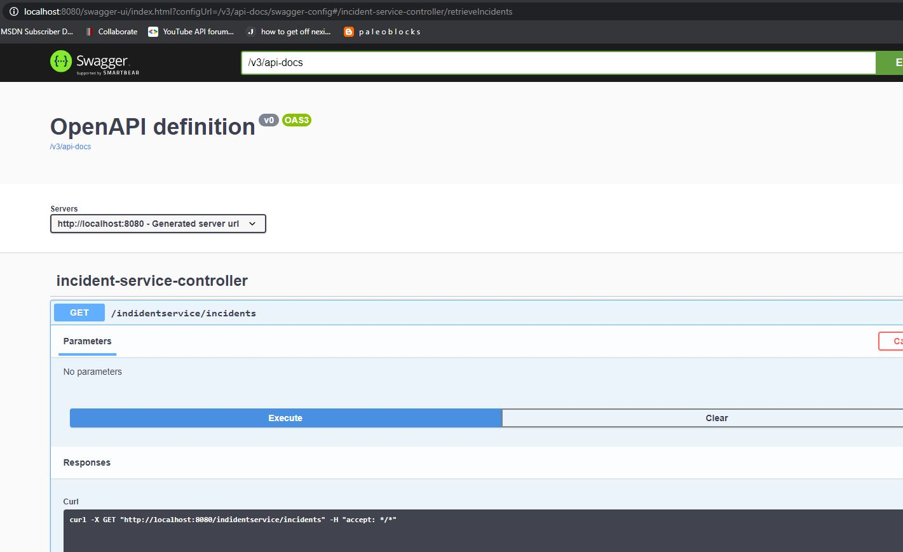
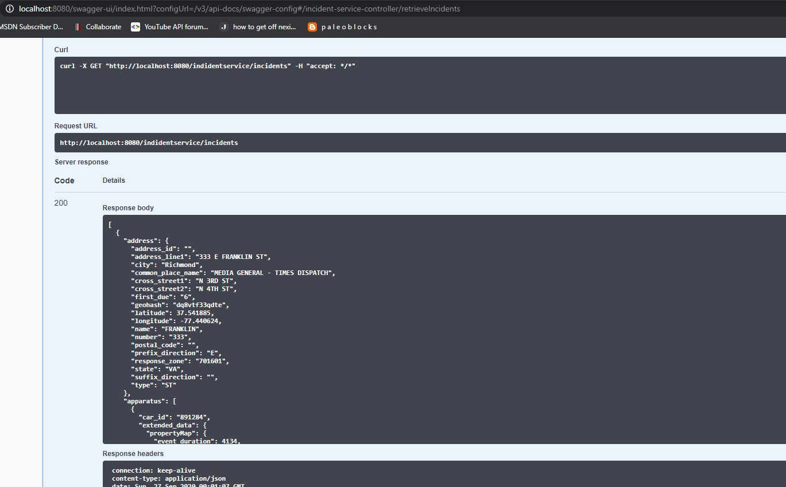

# Incident Service Project
## Assumptions
- you have the knowledge to install Java, Maven, and an IDE like Eclipse

## Dependencies
- Amazon Corretto 11 JDK
- maven 4.0+

## How to Run
- Have to download source from https://github.com/rakoch/incident-service.git
- use master branch
- adjust hard-coded path in application.properties to point where the json files exists for the project on your machine
- open a terminal or command shell
- cd to the project root--e.g., ~/workspace/incident-service
- start the app with this command: ./mvnw spring-boot:run
- after you see it reported that '...Started IncidentServiceApplication...' open up a browser 
- in the browser enter the link for openapi/swagger ui and try out the endpoint (click try it, then blue execute button): http://localhost:8080/swagger-ui.html

## How to run Integration Tests
- Have to download source from https://github.com/rakoch/incident-service.git
- use master branch
- adjust hard-coded path in application.properties to point where the json files exists for the project on your machine
- open a terminal or command shell
- cd to the project root--e.g., ~/workspace/incident-service
- type in command: mvn test
- should see results: Tests run: 2, Failures: 0, Errors: 0, Skipped: 0

## What I would have done if I had more time
- get the weather enrichment part of the project to work - I signed up for a token but after spending 15 minutes looking at the api, I figured it would be another 1-3 more hours for me
- make the models more flexible in case the JSON has dynamic properties - could do more Map<String, Object> or investigate other alternatives
- use a database that supports JSON and load the files into the database - probably would require me to use docker containers
- introduce authentication service & JWT token that works in conjunction with incident-service so you could require authentication (would most likely require docker and containers + docker-compose)
- perhaps implement repository/DAO abstraction layer that handled CRUD for the models rather than the load into memory method I did in the service abstraction
- add more endpoints that allow filtering and such
- add richer and less fragile endpoint tests 

## Example Swagger Test Session

